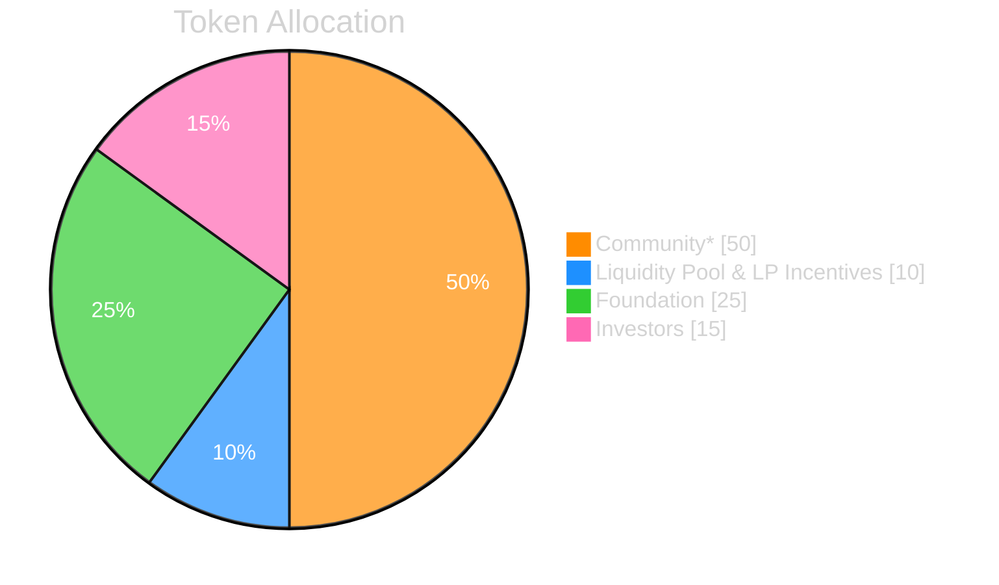

# All about $BORING

## Background

Before we take a deep dive on the $BORING, the token powering SuperBoring. Let's give a quick reminder of the main SuperBoring contracts:
- **`SuperBoring.sol`** : the main smart contract acting as the core contract of SuperBoring.
- **`TOREX.sol`**: [TOREX](/docs/torex) stands for T(WAP) OR(acle) EX(change), the smart contract engine used to make sure that the
funds accumulated (*in-tokens*) on the main SuperBoring contract are continuously and efficiently swapped for the destination asset (called *out-tokens).
You can think of the TOREX as the LP contract for each pair of in-tokens and out-tokens at SuperBoring.

:::tip TOREXes are directional
Each TOREX is directional, meaning that it can only Dollar-Cost-Average in one direction. For example, the pair ETHx-DAIx has a different deployed TOREX than the pair DAIx-ETHx.
:::

In addition to these contracts, the BORING token is a core part of the SuperBoring ecosystem.
It is used to incentivize traders to stake their $BORING tokens to TOREXes, and in return, they receive a share of the fees generated by the TOREXes.

## Tokenomics

### Token Details

The $BORING token is a utility token that is used to stake on different DCA markets ([TOREXes](/docs/torex)) to earn a portion of the revenue generated by that market.

| Property | Details |
|----------|---------|
| Token Name | SuperBoring |
| Ticker | BORING |
| Blockchain | Multichain |
| Fixed Initial Supply | 100,000,000 |
| Launch date/time | Jul-02-2024 11:20 AM UTC |
| BORING Token Contract (Ethereum Mainnet) | [0x0Bc4dF77353ae96f31bC82bC2536bb23B2009919](https://etherscan.io/address/0x0Bc4dF77353ae96f31bC82bC2536bb23B2009919) |
| BORING Token Contract (Bridged to Base) | [0x2112b92A4f6496B7b2f10850857FfA270464d054](https://basescan.org/token/0x2112b92A4f6496B7b2f10850857FfA270464d054) |
| BORING Token Contract (Bridged to Optimism) | [0xd9bfb8A24c8E1889787Ea0f99D77C952a82Bfe50](https://optimistic.etherscan.io/address/0xd9bfb8A24c8E1889787Ea0f99D77C952a82Bfe50) |

:::warning Tradability
Tradability of BORING is not currently enabled.
:::

### Token Allocations

*Ongoing incentives distributed for usage volume of SuperBoring.

## About the $BORING Staking Mechanisms

### The Fee structure

In order to understand how the BORING token works, we need to understand the fee structure of the TOREXes:
- Each TOREX takes a 0.5% fee on the in-tokens.
- A portion of the fee is then re-distributed to the stakers of the \$BORING token proportionally to the amount of \$BORING tokens they have staked.
- The other portion of the fee is kept by the interface operator - *Frontend Fee*

:::note How is that "portion" determined?
We will be adjusting the percentage of the fee shared with the stakers of the \$BORING token based on
multiple factors over time. We would like to keep this part of the protocol flexible and open to changes to ensure the long term
sustainability of the SuperBoring ecosystem.
:::

So how do you choose which TOREX to stake your $BORING tokens in? This is where the BORING quadratic emission formula comes into play.

### Quadratic Emission Formula
This part may be a bit complicated but hang in there! Here is all that you need to know:
- The distribution of BORING tokens to TOREXes is done through a [Distribution Pool](https://docs.superfluid.finance/docs/protocol/distributions/guides/pools).

:::tip What is a Distribution Pool?
A Distribution Pool is a primitive of the Superfluid Protocol and a special feature of Super Tokens.
It allows us to stream a token to a group of recipients in a scalable way. To learn more about it, please refer to the [Superfluid Protocol Documentation](https://docs.superfluid.finance/docs/concepts/overview/distributions).
:::
- Distribution Pools have what we call "member units" (=shares). According to the number of shares a TOREX has in a Pool, the TOREX will receive a proportional amount of \$BORING emissions.
- The quadratic emission formula is used to calculate the number of shares a TOREX has in a Pool based on the amount of \$BORING staked on that TOREX. The formula is as follows:

$torexShares=\left( \sum_{i \in stakers} \sqrt{stakedAmount(i)} \right)^2$

#### Example:
- Let's say that there are 2 TOREXes ETHx-DAIx and DAIx-ETHx.
- Alice stakes 100 \$BORING tokens in the ETHx-DAIx TOREX and 25 $BORING tokens in the DAIx-ETHx TOREX.
- Bob stakes 9 \$BORING tokens in the ETHx-DAIx TOREX and 36 $BORING tokens in the DAIx-ETHx TOREX.
- The TOREX shares in the Distribution Pool will be calculated as follows:
  - For the ETHx-DAIx TOREX: $torexShares = ( \sqrt{100} + \sqrt{9} )^2 = 13^2 = 169$, of which:
    - Alice will get $100/(100+9) * 169= 155$ shares
    - Bob will get $9/(100+9) * 169= 13$ shares
  - For the DAIx-ETHx TOREX: $torexShares = ( \sqrt{25} + \sqrt{36} )^2 = 11^2 = 121$, of which:
    - Alice will get $25/(25+36) * 121= 49$ shares
    - Bob will get $36/(25+36) * 121= 71$ shares
- The TOREXes will then receive a proportional amount of \$BORING emissions based on their shares in the Pool. In this case,
the DAIx-ETHx TOREX will receive less emissions than the ETHx-DAIx TOREX.