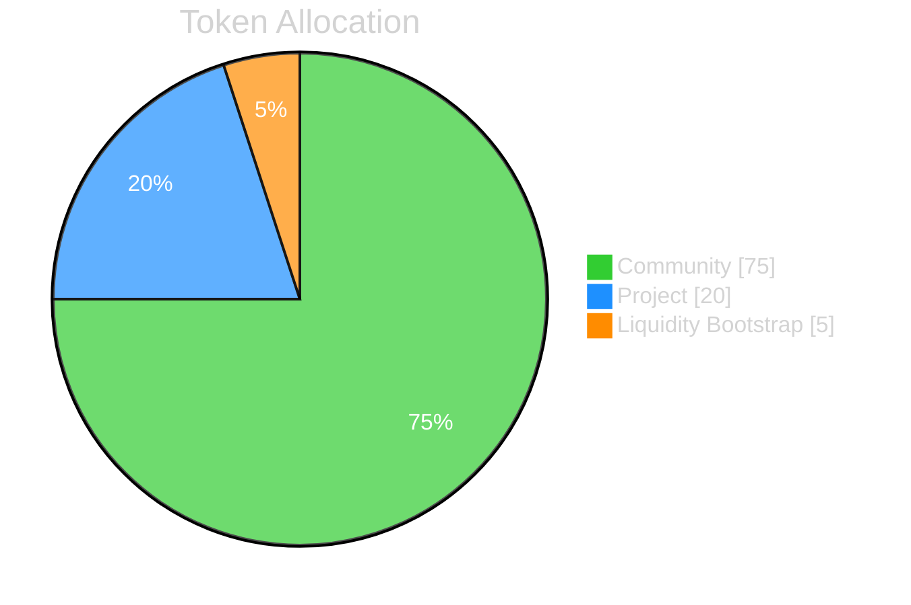

# All about $BORING

## Background

Before we take a deep dive on the \$BORING, the token powering SuperBoring. Let's give a quick reminder of the main SuperBoring contracts:
- **`SuperBoring.sol`** : the main smart contract acting as the core contract of SuperBoring.
- **`TOREX.sol`**: [TOREX](/docs/torex) stands for T(WAP) OR(acle) EX(change), the smart contract engine used to make sure that the
funds accumulated (*in-tokens*) on the main SuperBoring contract are continuously and efficiently swapped for the destination asset (called *out-tokens).
You can think of the TOREX as the LP contract for each pair of in-tokens and out-tokens at SuperBoring.
- **`SleepPod.sol`**: A per-user contract that holds a user's \$BORING. Staking, unlocking, and the AI Assistant all operate against the Sleep Pod balance.

:::tip TOREXes are directional
Each TOREX is directional, meaning that it can only Dollar-Cost-Average in one direction. For example, the pair ETHx-DAIx has a different deployed TOREX than the pair DAIx-ETHx.
:::

In addition to these contracts, the BORING token is a core part of the SuperBoring ecosystem.
It is used to incentivize traders to stake their \$BORING tokens to TOREXes, and in return, they receive a share of the fees generated by the TOREXes.

## Tokenomics

### Token Details

The \$BORING token is a utility token that is used to stake on different DCA markets ([TOREXes](/docs/torex)) to earn a portion of the revenue generated by that market.

| Property | Details |
|----------|---------|
| Token Name | SuperBoring |
| Ticker | BORING |
| Blockchain | Multichain |
| Fixed Initial Supply | 100,000,000 |
| Launch date/time | Jul-02-2024 11:20 AM UTC |
| BORING Token Contract (Ethereum Mainnet) | [0x0Bc4dF77353ae96f31bC82bC2536bb23B2009919](https://etherscan.io/address/0x0Bc4dF77353ae96f31bC82bC2536bb23B2009919) |
| BORING Token Contract (Bridged to Base) | [0x2112b92A4f6496B7b2f10850857FfA270464d054](https://basescan.org/token/0x2112b92A4f6496B7b2f10850857FfA270464d054) |
| BORING Token Contract (Bridged to Optimism) | [0xd9bfb8A24c8E1889787Ea0f99D77C952a82Bfe50](https://optimistic.etherscan.io/address/0xd9bfb8A24c8E1889787Ea0f99D77C952a82Bfe50) |

### Token Allocations

- **Community (75%)** — emitted to users over time via the [quadratic emission formula](#quadratic-emission-formula). This is the pool that rewards DCA activity and staking on TOREXes.
- **Project (20%)** — reserved for the team, contributors, and ongoing protocol development.
- **Liquidity Bootstrap (5%)** — seeds the initial on-chain markets (e.g. \$BORING/SUP, \$BORING/WETH) so users can acquire \$BORING outside of emissions.

## Sleep Pods

A **Sleep Pod** is a per-user, on-chain vault that holds your \$BORING. It is automatically created the first time you start earning \$BORING from a DCA position,
and from that point onward it is the only place where your \$BORING lives while it is being used inside SuperBoring.

A Sleep Pod is what gives you access to the protocol's core mechanics:

- **Staking** — only \$BORING held in your Sleep Pod can be staked on TOREXes to earn a share of trading fees.
- **AI Assistant** — the [AI Assistant (experimental)](/docs/ai-assistant) feature is paid for in \$BORING burned out of the Sleep Pod.
- **Unlocking** — moving \$BORING *out* of the Sleep Pod (to a regular wallet) goes through the [unlock flow](#sleep-pod-unlocking-rules) described below.

### Getting $BORING into your Sleep Pod

There are two ways to acquire \$BORING:

1. **Earn it from DCA** — when you run a DCA position on Base, \$BORING emissions are streamed directly into your Sleep Pod. No action needed on your part.
2. **Buy it on Uniswap** — you can purchase \$BORING from the \$BORING/SUP or \$BORING/WETH pools on Base.

\$BORING bought on Uniswap lands in your regular wallet. To use it inside SuperBoring (stake, AI Assistant), you must deposit it into your Sleep Pod.
This is a plain ERC-20 transfer — no special smart contract calls are required. The SuperBoring UI offers two ways to do this:

- Send \$BORING from your connected wallet via the deposit form, or
- Copy your Sleep Pod's deposit address and send \$BORING to it from anywhere.

:::tip Why is it called a "Sleep Pod"?
\$BORING that sits in a Sleep Pod is "sleeping" — it is held safely and can be staked or spent inside SuperBoring, but it cannot be freely transferred out
until it goes through the unlock process. This protects long-term emissions from being instantly dumped on the market.
:::

### Sleep Pod Unlocking Rules

To move \$BORING from your Sleep Pod back into a regular wallet (i.e. to make it freely transferable), you must **unlock** it.
There are two unlock paths, both of which apply a tax that goes to the protocol treasury (`taxRecipient`).

#### 1. Instant unlock

You receive a portion of the amount immediately in your wallet; the rest is sent to the treasury as a penalty.

- **Penalty:** `instantUnlockPenaltyBP = 8000` → **80%** is taxed.
- **You receive 20%** of the amount you chose to unlock, instantly.

#### 2. Vested unlock

You pick an unlock period between `minUnlockPeriod` and `maxUnlockPeriod`. The contract spawns a `BoringFontaine` streaming contract that pays you continuously over the chosen period.
The longer you vest, the larger the share you keep.

The unlock percentage follows a square-root curve:

$unlockedPct = minPct + (100\% - minPct) \times \sqrt{\frac{period}{maxPeriod}}$

Where `minPct = vestUnlockMinPercentageBP = 3000` → 30%, and `maxPeriod = 360 days`.

#### Parameters

| Parameter | Value | Meaning |
|-----------|-------|---------|
| `instantUnlockPenaltyBP` | `8000` (80%) | Tax applied when you unlock instantly. |
| `vestUnlockMinPercentageBP` | `3000` (30%) | The floor used in the vested-unlock sqrt curve. |
| `minUnlockPeriod` | `7 days` | Shortest allowed vested-unlock period. |
| `maxUnlockPeriod` | `360 days` | Period at which a vested unlock returns 100% of the amount. |
| `earlyEndPeriod` | `7 days` | Window before the end of a vest in which `terminateUnlock()` becomes callable (stops the stream early and forwards the remainder). |
| `taxRecipient` | `treasury.superboring.eth` | Receives all unlock penalties / vesting taxes. |

#### Example: how much do I get for different vesting periods?

For a 1,000 \$BORING unlock with the parameters above:

| Period | Formula | Unlocked % | You receive | Tax to treasury |
|--------|---------|------------|-------------|-----------------|
| Instant (0) | flat 20% | 20.0% | 200 \$BORING immediately | 800 \$BORING |
| 7 days | 30% + 70% × √(7/360) | ≈ 39.8% | ≈ 398 \$BORING streamed over 7d | ≈ 602 \$BORING |
| 30 days | 30% + 70% × √(30/360) | ≈ 50.2% | ≈ 502 \$BORING streamed over 30d | ≈ 498 \$BORING |
| 90 days | 30% + 70% × √(90/360) | ≈ 65.0% | ≈ 650 \$BORING streamed over 90d | ≈ 350 \$BORING |
| 180 days | 30% + 70% × √(180/360) | ≈ 79.5% | ≈ 795 \$BORING streamed over 180d | ≈ 205 \$BORING |
| 360 days | 30% + 70% × √(360/360) | 100.0% | 1000 \$BORING streamed over 360d | 0 |

:::note Streaming via BoringFontaine
A vested unlock does not "drip" your tokens out as a series of claims — it creates a dedicated `BoringFontaine` contract that **streams** \$BORING to your recipient address
in real time using Superfluid. You see the balance increase second-by-second. Anyone can call `terminateUnlock()` in the final `earlyEndPeriod` window to close the stream
and forward the remaining balance to the recipient.
:::

## About the $BORING Staking Mechanisms

### The Fee structure

Each TOREX charges a small fee on the in-tokens it processes:

- **Total fee:** 0.5% of the in-token volume.
- **Where it goes:** the entire fee is redistributed to \$BORING **stakers** of that TOREX, proportionally to the amount of \$BORING each staker has on it.

:::info Frontend Fee has been removed
Previously, a portion of the 0.5% fee was kept by the interface operator (the "frontend" / distributor that the user came through) — this was called the **Frontend Fee**.
The frontend fee, along with the entire distribution-fee module (`DistributionFeeManager`, `DistributorFeeCollector`, `DistributionFeeDIP`), has been **removed** as of
SuperBoring contracts v2.0.0. The full fee now goes to TOREX stakers. Interface operators continue to earn through the [referral program](/docs/referrals).
:::

So how do you choose which TOREX to stake your \$BORING tokens in? This is where the BORING quadratic emission formula comes into play.

### Quadratic Emission Formula
This part may be a bit complicated but hang in there! Here is all that you need to know:
- The distribution of BORING tokens to TOREXes is done through a [Distribution Pool](https://docs.superfluid.finance/docs/protocol/distributions/guides/pools).

:::tip What is a Distribution Pool?
A Distribution Pool is a primitive of the Superfluid Protocol and a special feature of Super Tokens.
It allows us to stream a token to a group of recipients in a scalable way. To learn more about it, please refer to the [Superfluid Protocol Documentation](https://docs.superfluid.finance/docs/concepts/overview/distributions).
:::
- Distribution Pools have what we call "member units" (=shares). According to the number of shares a TOREX has in a Pool, the TOREX will receive a proportional amount of \$BORING emissions.
- The quadratic emission formula is used to calculate the number of shares a TOREX has in a Pool based on the amount of \$BORING staked on that TOREX. The formula is as follows:

$torexShares=\left( \sum_{i \in stakers} \sqrt{stakedAmount(i)} \right)^2$

#### Example:
- Let's say that there are 2 TOREXes ETHx-DAIx and DAIx-ETHx.
- Alice stakes 100 \$BORING tokens in the ETHx-DAIx TOREX and 25 \$BORING tokens in the DAIx-ETHx TOREX.
- Bob stakes 9 \$BORING tokens in the ETHx-DAIx TOREX and 36 \$BORING tokens in the DAIx-ETHx TOREX.
- The TOREX shares in the Distribution Pool will be calculated as follows:
  - For the ETHx-DAIx TOREX: $torexShares = ( \sqrt{100} + \sqrt{9} )^2 = 13^2 = 169$, of which:
    - Alice will get $100/(100+9) * 169= 155$ shares
    - Bob will get $9/(100+9) * 169= 13$ shares
  - For the DAIx-ETHx TOREX: $torexShares = ( \sqrt{25} + \sqrt{36} )^2 = 11^2 = 121$, of which:
    - Alice will get $25/(25+36) * 121= 49$ shares
    - Bob will get $36/(25+36) * 121= 71$ shares
- The TOREXes will then receive a proportional amount of \$BORING emissions based on their shares in the Pool. In this case,
the DAIx-ETHx TOREX will receive less emissions than the ETHx-DAIx TOREX.

### Emission Schedule

Community emissions follow a **deadline-based** schedule. Instead of targeting a fixed emission rate, the contract continuously rebalances the emission rate so that the
remaining community supply linearly drains to zero at a configured `emissionEndTime`.

- The current `emissionEndTime` is set to **2 years from TGE** via `govQEUpdateEmissionEndTime`.
- The per-block emission rate adjusts automatically as balances change: $emissionRate = \frac{balanceLeft \cdot q^2}{qqSum \cdot timeRemaining}$.
- After the end time, no further community emissions are produced.
